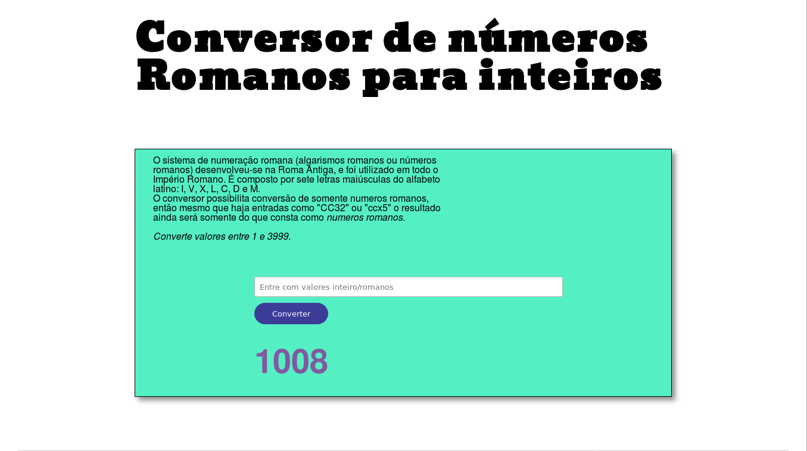

# projeto_ConverRomanos
Aplicação web simples para conversão de simbolos romanos para valores inteiros.

# Informações
 * Versão 1.0.0
 * Para executar acesse index.html
 * A aplicação se utiliza de fontes google da internet (cuidado para não executar offline e perder as fontes).

# Valores de entrada
Basicamente você pode entrar com os seguintes simbolos romanos:
*I, V, X, L, C, D e M* .
Esses serão os únicos simbolos lidos pela entrada da aplicaçao, independente
do que você insira entre eles.

```
  IV35M = 1004

  MasddfX = 990
```
Os valores desta versão estão limitados ao alcance 1 a 3999.

# Imagens

# Copyright
Projeto realizado sob a [MIT License](https://github.com/Nabucodono5or/projeto_ConverRomanos/blob/master/LICENSE).
